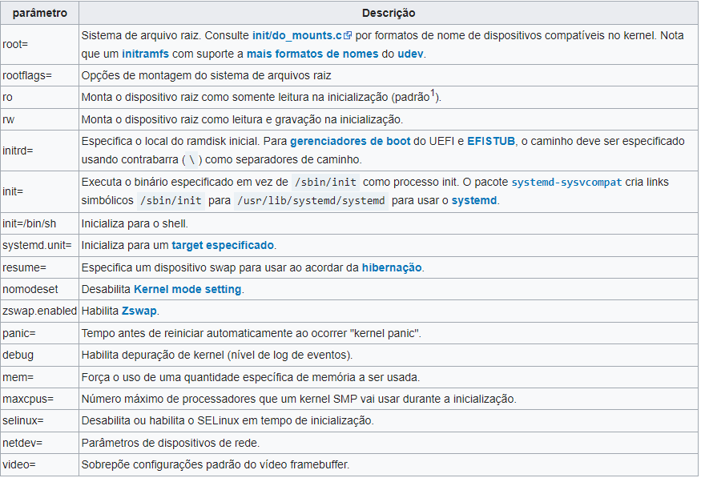

## Parâmetro: vm.swappiness

Função:

O Swappiness é um parâmetro do Kernel, que permite configurar a flexibilidade do sistema no uso de Swap.

É uma configurado padrão, mas podemos modificar o Swappiness via sysctl.

Sua configuração é feita com valores de 0 à 100, quanto menor o número, menor será o uso de Swap.

No nosso caso, usamos o vm.swappiness = 10.

## Memória e CPU

Uso da CPU antes: 1.3%

Uso da memória antes: 0.5%

CPU depois: 0.7%

Memória depois: 0.2%

## Outros Parâmetros

