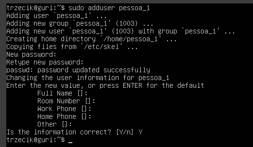
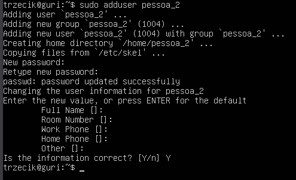
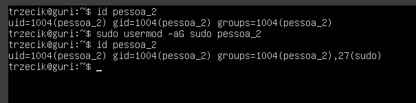
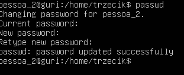
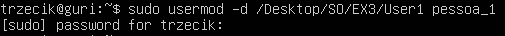
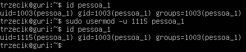
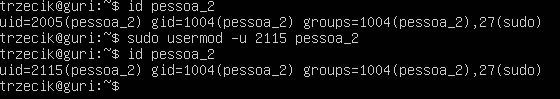
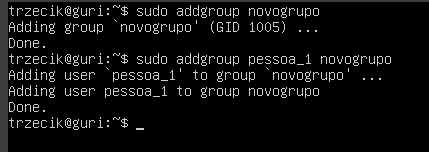
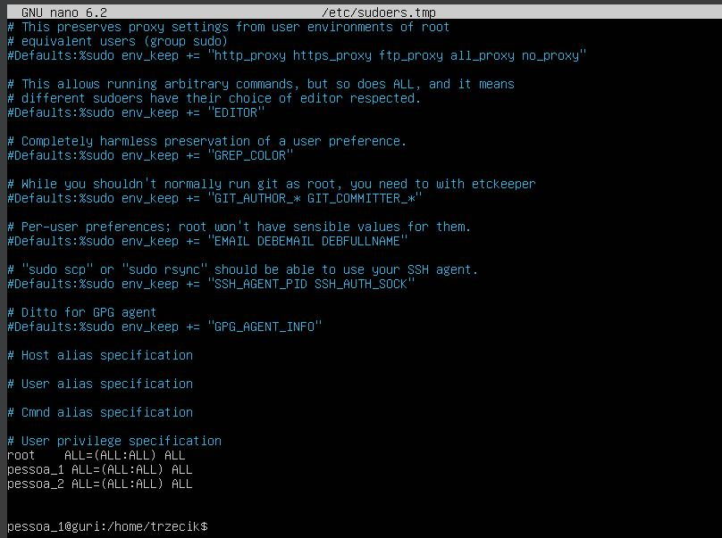

## A.

## Usuario Regular:

### Comando para criar o usuario:

sudo adduser pessoa_1

A senha defina foi "pessoa_1"

## Administrador:

### Comando para criar o Administrador:

sudo adduser pessoa_2

A senha defina foi "pessoa_2"

Para transformar o usuario em Administrador foi usado o comando "sudo usermod -aG sudo pessoa_2"

## B.

Usei o comando passwd no usuário "pessoa_2" e troquei a senha para "senha_troca".

## C.

O comando para mudar o diretório inicial foi:

pessoa_1:

pessoa_2:

## D.

O comando para mudar o UID foi:

pessoa_1:

pessoa_2:

## E.

Comando para criar um novo grupo de utilizadores e adicionar o utilizador regular:

## F e G.

Para adicionar permissões usei o comando "sudo visudo /etc/sudoers" que me leva para um ficheiro onde eu posso adicionar as permissões

