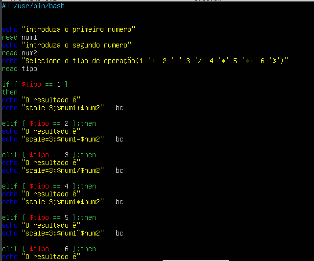
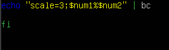

## 1º passo

#### Criar o ficheiro ".sh" usando o comando "touch calc.sh"

## 2º passo

#### Entrar no ficheiro usando o comando "nano calc.sh"

## 3º passo

#### Fazer o codigo da calculadora:

#### Final do codigo que não coube na imagem:

## 4º passo

#### Executar o codigo usando o comando "bash calc.sh"
